#FastAPI server that validates ZedOffice license

ZED Office RestAPI helps you do some stuff. 🚀

## 🔒 Authentication
You will be able to:

* **Login** - login using a valid email and password
* **Logout** - to logout from the system 

## 🏠 Main
You can see how the API works to navigate through all open pages

## 🔑 Licensing
You will be able to:

* **List all available licenses* - open to every user
* **Create License** - open to every user
* **Delete License** - locked to registered users. You need to register to be able to use the API
* **Validate License** - **requires a valid software token*

## 🙋 User Panel
Only for registered users, and you will be able to:
* **List user licenses* - users can currently have only one license at a time
* **Create Details** - users can change their passwords. Usernames are immutable
* **Delete License** - users can delete their license prior to get another
* **Check Orders** - placeholder for further developments. Only routing at the moment
* **Validate License** - **requires a valid software token*

### Installation

```
Navigate to the files path and run with CMD command -> uvicorn Main:router
```

## Interfaces
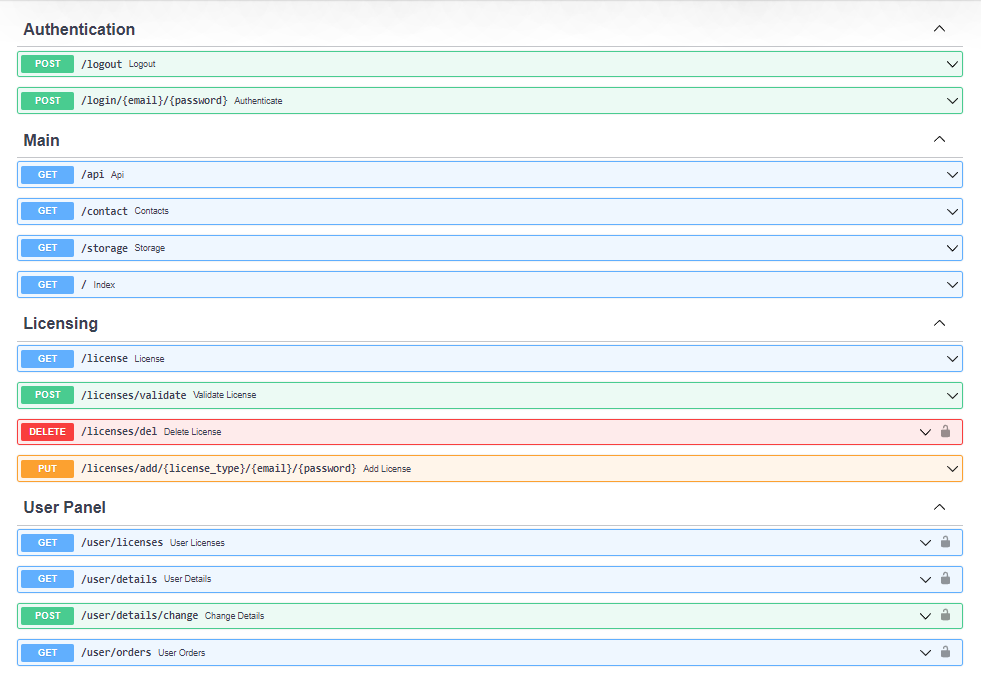
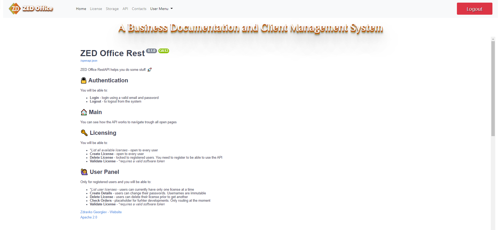
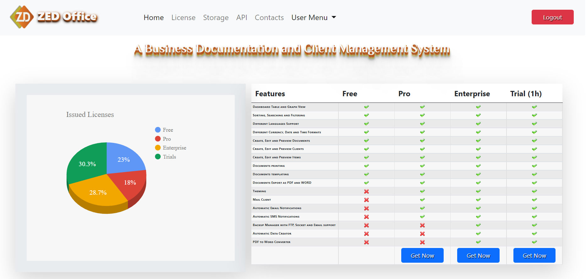
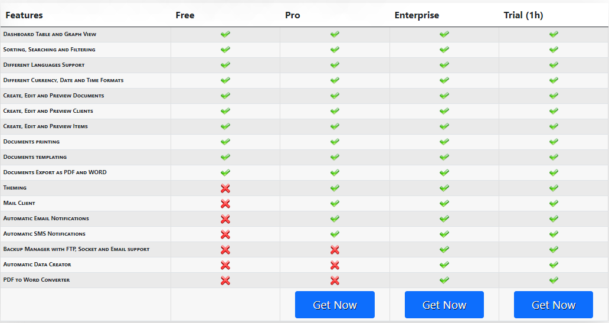
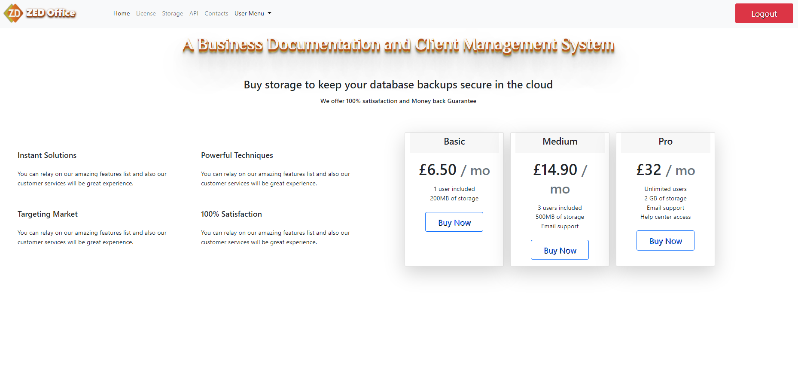
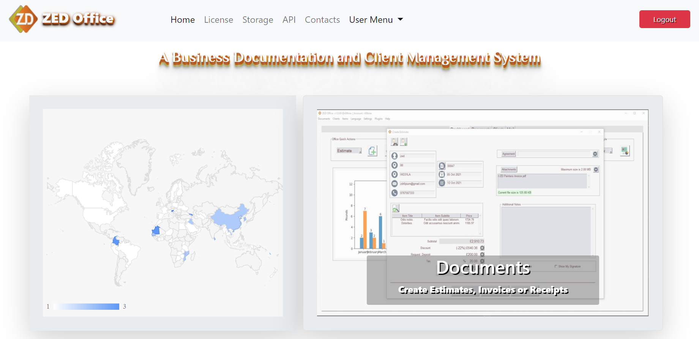
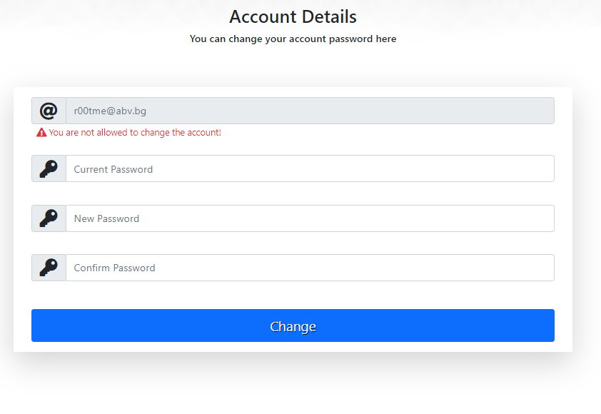
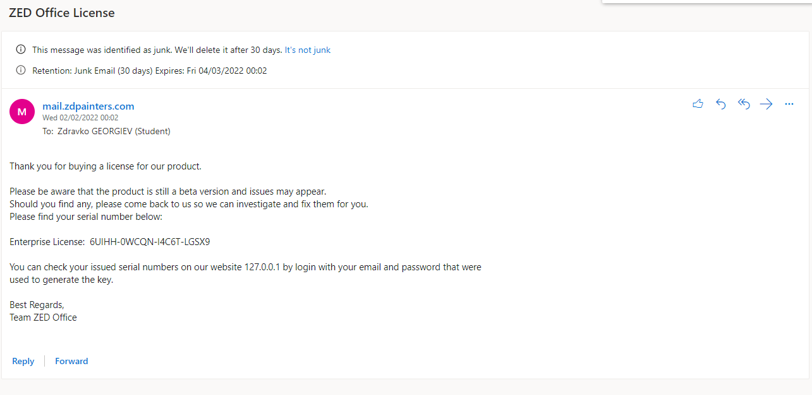
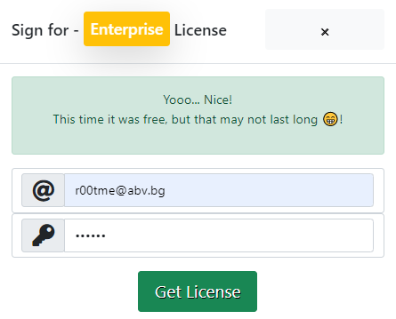
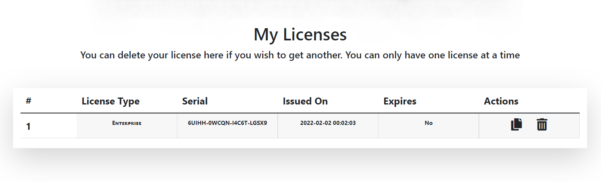
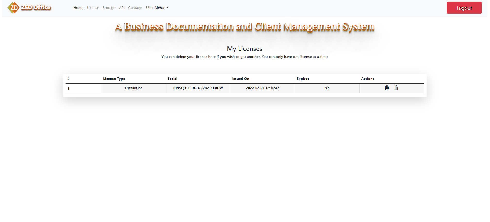
