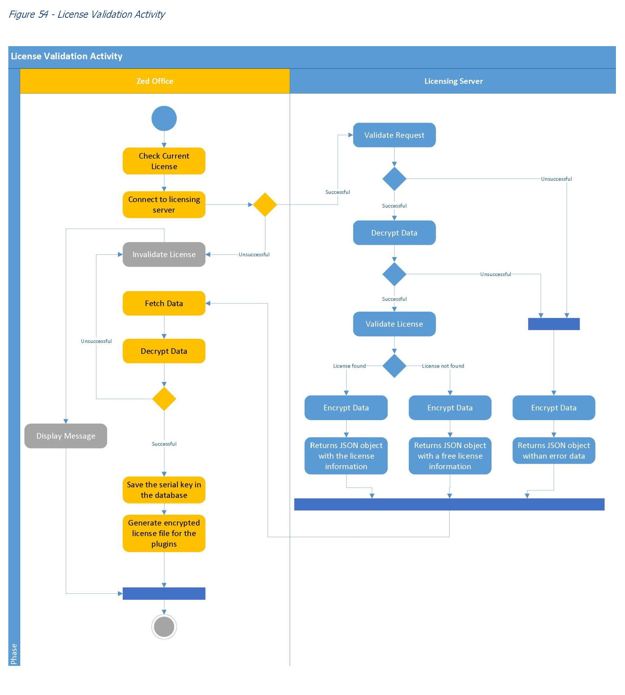

# BACHELOR OF SCIENCE FINAL YEAR PROJECT  - COMPUTER SCIENCE 
#### The full sourcecode, software engineering reports and UML diagrams are available on request ! 

Some Tests and Presentation -> https://www.youtube.com/channel/UCB21WRSqZG7Dk2oPSkQKM-A

Author: Zdravko Georgiev 

### Report : <a href="https://github.com/r00tmebaby/A-Business-Documentation-and-Client-Management-System/blob/main/Report.pdf">Report Overview</a>

## Some UML Diagrams

### Overview of the program

### Licensing activity diagram

### Program start activity diagram

