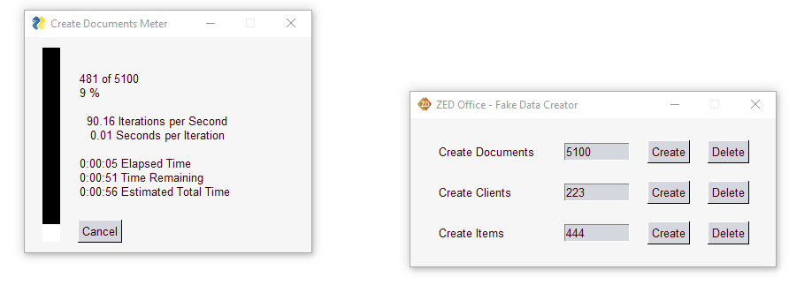
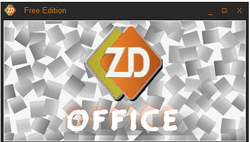
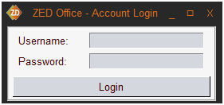
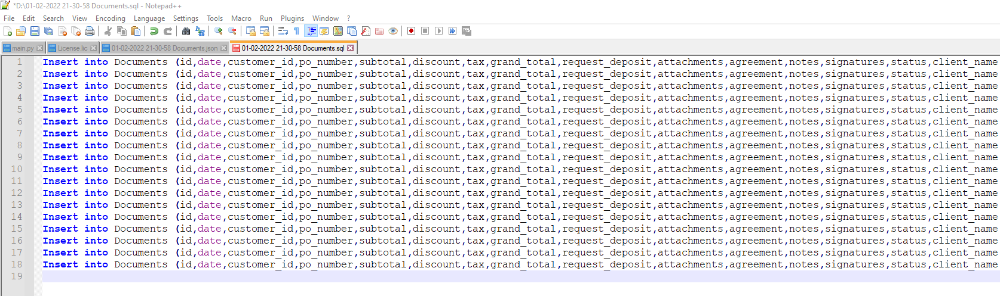

##Abstract

* You are running a limited company or working as a sole trader in the construction industry. As such, HMRC advises that you must keep all records of all your business paperwork for up to six years. When they state business paperwork, the meaning is all relevant information issued and received from you over the years related to the income and expenses you had. 

* Imagine a scenario where you have worked in the sector for a couple of years. You were lucky, and your successful business model completed thousands of projects, and most certainly, many of them were returning customers. That is all great, but you may be surprised that keeping information for old customers such as their phone numbers, emails, correspondence, and business paperwork is a big headache to get organized and filed. You often get into a confusing situation by not recognizing a returning customer call and finding what you have done, the cost, and when it happened. 

* Last but not least, answering the question of how much you earned a couple of years ago, what expenses you have had and how many projects you finished every month is an impossible question to answer.  	
	
	
* Summarising the above, it appears that finding a way of keeping all those records is an unavoidable part of the administration of such business. Unfortunately, using many applications to achieve all needs is a management issue. Such an approach can trigger errors, data loss, or leakage, leading to decreasing sales or triggering crucial business decisions. 

* This project is business documentation and clients management system named "ZED Office". It is a digital solution for the above-described problems.

# Program interfaces

